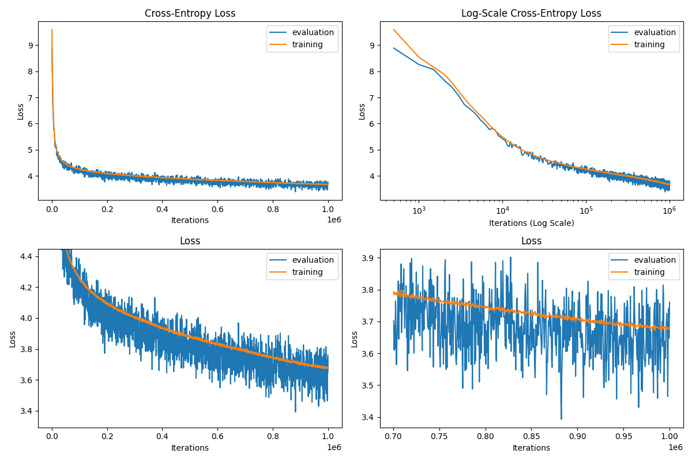

# GPT-2 PyTorch Implementation

[Language Models are Unsupervised Multitask Learners](https://cdn.openai.com/better-language-models/language_models_are_unsupervised_multitask_learners.pdf)

## Introduction
This project is a pytorch implementation of OpenAI GPT-2 model. It provides model training, sentence generation, and metrics visualization. It is considered to be both understandable and optimized. We designed the codes to be comprehensible. Also we use [some techniques](#using-apex-for-training) to improve performance.

## Dependencies
* regex
* tqdm
* torch
* numpy
* matplotlib

## Using [apex](https://github.com/NVIDIA/apex) for training
While training, you can use **NVIDIA apex** to use fused CUDA layers and mixed-precision optimization. The option `--use_amp` enables **automatic mixed precision** in training. Before using these performance boosting, you should install **NVIDIA apex** library by following [the repository](https://github.com/NVIDIA/apex), or run belows:

    $ git clone https://github.com/NVIDIA/apex
    $ cd apex
    $ pip install -v --no-cache-dir --global-option="--cpp_ext" --global-option="--cuda_ext" ./

If you cannot install the library or your GPU device does not support fast mixed-precision training (precisely, GPU should support mixed-precision acceleration through [Tensor Cores](https://developer.nvidia.com/tensor-cores)), you can train the model in single-precision mode. Mixed-precision training is an option.

## How to train?
Before training GPT-2 model, corpus dataset should be prepared. We recommmend to build your own corpus by using [Expanda](https://github.com/affjljoo3581/Expanda). Instead, training module requires tokenized training and evaluation datasets with their vocabulary file.

After preparing your datasets, you can train GPT-2 by using as follows:

    $ python -m gpt2 train --train_corpus     build/corpus.train.txt \
                           --eval_corpus      build/corpus.test.txt \
                           --vocab            build/vocab.txt \
                           --checkpoint       ckpt \
                           --batch_train      96 \
                           --batch_eval       128 \
                           --seq_len          64 \
                           --layers           12 \
                           --heads            16 \
                           --dims             1024 \
                           --rate             4 \
                           --dropout          0.1 \
                           --base_lr          0.0001 \
                           --iterations       1000000 \
                           --warmup_iters     10000 \
                           --eval_iters       500 \
                           --save_iters       5000 \
                           --use_amp

To resume training from last checkpoint file, use `--restore [last checkpoint file]` option.

## Generate sentences!
After training GPT-2, you can generate sentences with your trained model in interactive mode.

    $ python -m gpt2 generate --vocab            build/vocab.txt \
                              --checkpoint       ckpt \
                              --seq_len          64 \
                              --layers           12 \
                              --heads            16 \
                              --dims             1024 \
                              --rate             4 \
                              --temperature      0.8 \
                              --samples          20 \
                              --topk             40

## Visualization
Moreover, there is a module to visualize training metrics.

    $ python -m visualize --figure figure.png --checkpoint ckpt

The example figure is as bellow:

